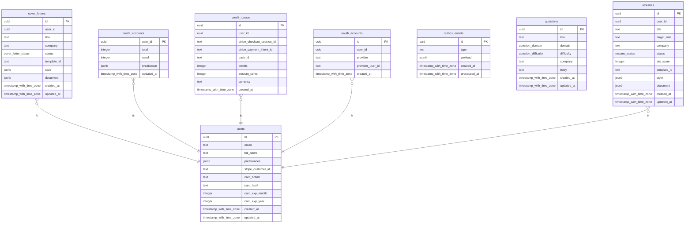

# Database schema

Auto-generated from Drizzle schema via `npm run db:schema:mermaid`. Do not edit by hand.

```mermaid
erDiagram
  cover_letters {
    uuid id PK
    uuid user_id
    text title
    text company
    cover_letter_status status
    text template_id
    jsonb style
    jsonb document
    timestamp_with_time_zone created_at
    timestamp_with_time_zone updated_at
  }
  credit_accounts {
    uuid user_id PK
    integer total
    integer used
    jsonb breakdown
    timestamp_with_time_zone updated_at
  }
  credit_topups {
    uuid id PK
    uuid user_id
    text stripe_checkout_session_id
    text stripe_payment_intent_id
    text pack_id
    integer credits
    integer amount_cents
    text currency
    timestamp_with_time_zone created_at
  }
  oauth_accounts {
    uuid id PK
    uuid user_id
    text provider
    text provider_user_id
    timestamp_with_time_zone created_at
  }
  outbox_events {
    uuid id PK
    text type
    jsonb payload
    timestamp_with_time_zone created_at
    timestamp_with_time_zone processed_at
  }
  questions {
    uuid id PK
    text title
    question_domain domain
    question_difficulty difficulty
    text company
    text body
    timestamp_with_time_zone created_at
    timestamp_with_time_zone updated_at
  }
  resumes {
    uuid id PK
    uuid user_id
    text title
    text target_role
    text company
    resume_status status
    integer ats_score
    text template_id
    jsonb style
    jsonb document
    timestamp_with_time_zone created_at
    timestamp_with_time_zone updated_at
  }
  users {
    uuid id PK
    text email
    text full_name
    jsonb preferences
    text stripe_customer_id
    text card_brand
    text card_last4
    integer card_exp_month
    integer card_exp_year
    timestamp_with_time_zone created_at
    timestamp_with_time_zone updated_at
  }
  cover_letters }o--|| users : "fk"
  credit_accounts }o--|| users : "fk"
  credit_topups }o--|| users : "fk"
  oauth_accounts }o--|| users : "fk"
  resumes }o--|| users : "fk"
```
